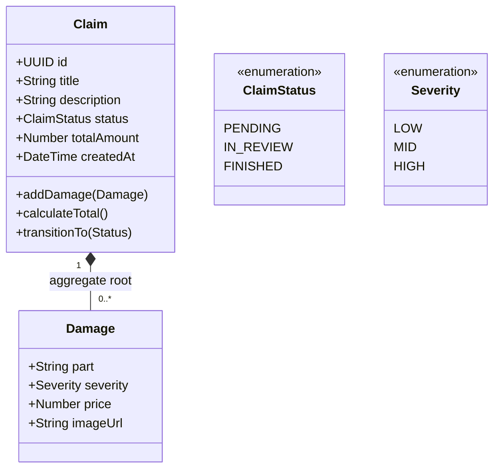

# 01 – Domain Model

## 1. Contexto del sistema

El **Claims Management System** es el núcleo de negocio encargado del ciclo de vida de los siniestros. Su responsabilidad es garantizar la integridad de los datos, orquestar las transiciones de estado y asegurar la consistencia financiera del reclamo.

Este modelo está diseñado siguiendo principios de **DDD (Domain-Driven Design)**, aislando la lógica de negocio de la infraestructura tecnológica mediante el uso de Entidades, Agregados y Objetos de Valor.

---

## 2. Lenguaje del dominio (Ubiquitous Language)

| Término          | Definición                                                              |
| :--------------- | :---------------------------------------------------------------------- |
| **Claim**        | Expediente único de siniestro que agrupa daños. Es el _Aggregate Root_. |
| **Damage**       | Perjuicio material específico reportado dentro de un reclamo.           |
| **Severity**     | Clasificación cualitativa del daño (`Low`, `Mid`, `High`).              |
| **Total Amount** | Valor financiero agregado. Suma aritmética de los precios de los daños. |

---

## 3. Diagrama de Clases (Conceptual)

