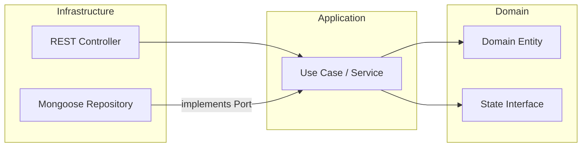

# 03 – System Architecture

## 1. Executive Summary

El sistema está diseñado bajo el paradigma de **Clean Architecture** y **Arquitectura Hexagonal (Ports & Adapters)**. Esta elección garantiza que las reglas de negocio (Dominio) permanezcan aisladas de agentes externos como la base de datos (MongoDB) o el framework de transporte (Express/Angular).

Esta estructura facilita el cumplimiento del requerimiento de **Dependency Injection (DI)** y permite alcanzar un **test coverage >95%** al poder testear el core del negocio sin dependencias de infraestructura.

---

## 2. Monorepo Structure

Se utiliza una estructura de **Monorepo** para asegurar la consistencia del contrato **SDD (Spec-Driven Development)**:

- `apps/api`: Backend Node.js/TypeScript.
- `apps/client`: Frontend Angular.
- `docs/`: Documentación técnica y especificaciones OpenAPI.

---

## 3. Backend: Hexagonal Architecture

El Backend se organiza en capas concéntricas donde la dependencia siempre va hacia el interior (el Dominio).

### 3.1 Domain Layer (The Core)

- **Entities:** `Claim` y `Damage`. Contienen la lógica de cálculo del total.
- **Domain Services:** Implementación del **State Pattern** para las transiciones de estatus.
- **Ports (Interfaces):** Definición de contratos para repositorios (ej: `IClaimRepository`).

### 3.2 Application Layer (Use Cases)

- Contiene los orquestadores de la lógica de negocio (ej: `AddDamageUseCase`, `TransitionStatusUseCase`).
- No conoce la existencia de MongoDB ni de Express.

### 3.3 Infrastructure Layer (Adapters)

- **HTTP Adapters:** Controladores REST que validan el esquema de entrada.
- **Persistence Adapters:** Implementaciones concretas de Mongoose para MongoDB.
- **DI Container:** Configuración del contenedor de Inversión de Control (IoC).

