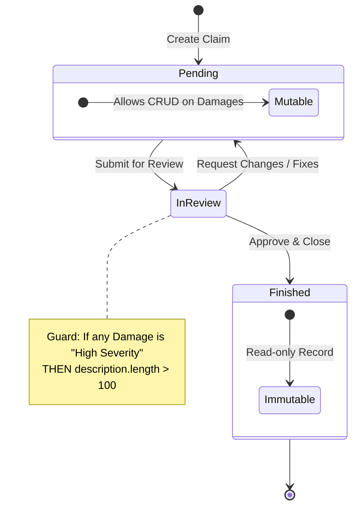

# 05 – State Machine & Lifecycle

## 1. Propósito

Este documento define el comportamiento dinámico del `Claim`. La máquina de estados actúa como la "fuente de verdad" para las restricciones de mutabilidad de los daños y las condiciones de cierre del expediente, garantizando que las reglas de negocio se apliquen de forma consistente.

---

## 2. Diagrama de Transiciones (Mermaid)

Este diagrama detalla los estados permitidos y las condiciones necesarias (guards) para disparar cada transición.

